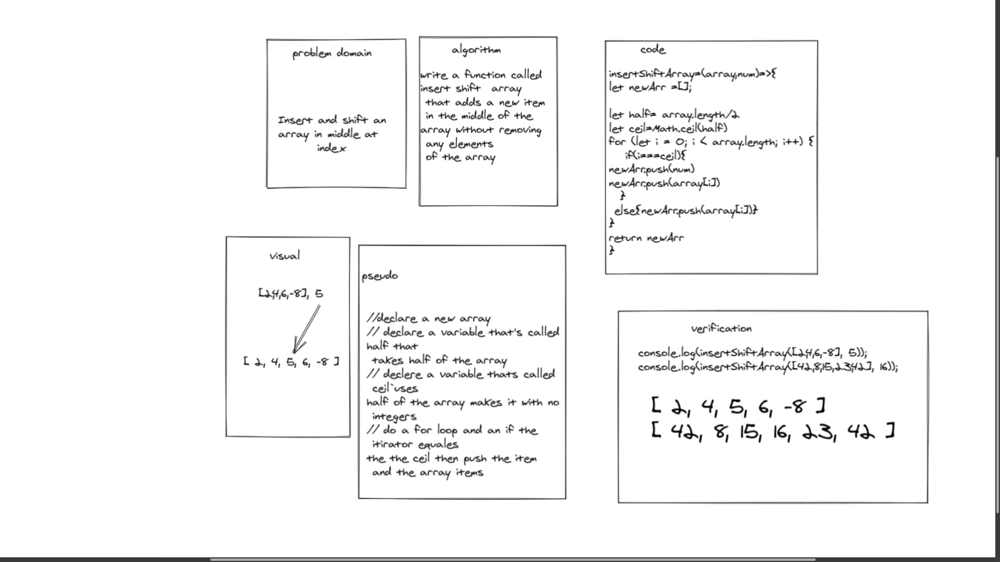
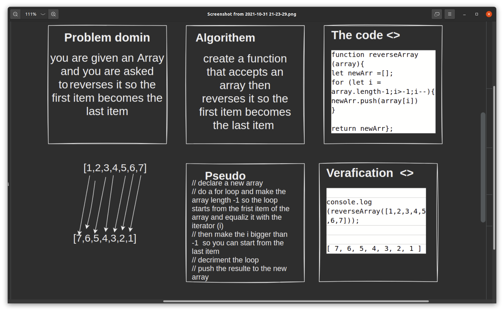

# Data Structures and Algorithms

See [setup instructions](https://codefellows.github.io/setup-guide/code-301/3-code-challenges), in the Code 301 Setup Guide.

## Repository Quick Tour and Usage

### 301 Code Challenges

Under the `javascript` folder, at the top level, is a sub-folder called `code-challenges`

Each day, you'll add one new file to this folder to do your work for the day's assigned code challenge

If you have not already done so, run `npm install` from within this folder to setup your system to be able to run tests using `Jest`

To run your tests

- Change to the `javascript` folder
- run `npm test` to run all of the tests
- run `npm test ##` to only run tests for challenge ## (i.e. 01)

### 401 Data Structures, Code Challenges

- Please follow the instructions specific to your 401 language, which can be found in the directory below, matching your course.

#### array-shift
write a function called insert shift array that adds a new item in the middle of the array without removing 
any elements of the array

#### Whiteboard Process

#### Approach & Efficiency
I think my method is one better ways to implement to to mutiple array in a dynamic way the method 

//declare a new array 

// declare a variable that's called half that
takes half of the array 

// declere a variable thats called ceil uses half of the array makes it with no integers 

// do a for loop and an if the itirator equales 
the the ceil then push the item and the array items 

-----------------------------
#### Reverse an Array
create a function that accepts an array then reverses it so the first item becomes the last item 

#### Whiteboard Process

#### Approach & Efficiency
//  i declared a new array 
// did a for loop and made the array length -1 so the loop starts from the first item of the array and equalize it with the iterator (i)
// then make the i bigger than -1  so you can start from the last item 
// decrement the loop
// push the results to the new array  
