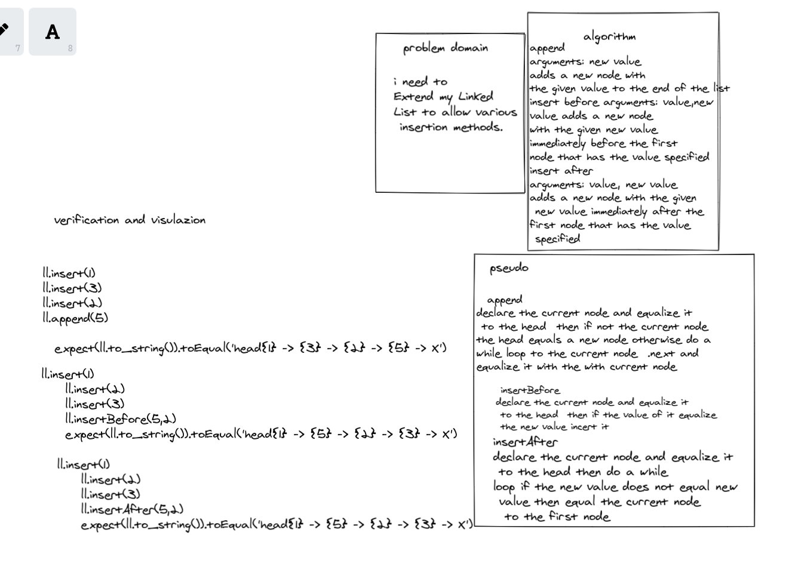

# Data Structures and Algorithms

See [setup instructions](https://codefellows.github.io/setup-guide/code-301/3-code-challenges), in the Code 301 Setup Guide.

## Repository Quick Tour and Usage

### 301 Code Challenges

Under the `javascript` folder, at the top level, is a sub-folder called `code-challenges`

Each day, you'll add one new file to this folder to do your work for the day's assigned code challenge

If you have not already done so, run `npm install` from within this folder to setup your system to be able to run tests using `Jest`

To run your tests

- Change to the `javascript` folder
- run `npm test` to run all of the tests
- run `npm test ##` to only run tests for challenge ## (i.e. 01)

### 401 Data Structures, Code Challenges

- Please follow the instructions specific to your 401 language, which can be found in the directory below, matching your course.

| Reverse-an-Array       |    [link](https://marwan-zakia.github.io/data-structures-and-algorithms/Reverse-an-Array.md)     |

| OR Reverse-an-Array       |   [link](https://github.com/Marwan-Zakia/data-structures-and-algorithms/blob/main/Reverse-an-Array.md)  |

| array-shift       |    [link](https://marwan-zakia.github.io/data-structures-and-algorithms/array-shift.md)     |

| OR array-shift       |    [link](https://github.com/Marwan-Zakia/data-structures-and-algorithms/blob/main/array-shift.md)     |

| array-binary-search        |    [link](https://marwan-zakia.github.io/data-structures-and-algorithms/array-binary-search.md)     |

| OR array-binary-search       |    [link](https://github.com/Marwan-Zakia/data-structures-and-algorithms/blob/main/array-binary-search.md)     |

## Challenge
create a linkedlist Create a Node class that has properties for the value stored in the Node, and a pointer to the next Node and create a Linked List class
Within your Linked List class, include a head property.
Upon instantiation, an empty Linked List should be created.
also expand on it and make  3  new functions which are append and incert before and after 
## checklist
- [x] Can successfully instantiate an empty linked list
- [x] Can properly insert into the linked list
- [x] The head property will properly point to the first node in the linked list
- [x] Can properly insert multiple nodes into the linked list
- [x] Will return true when finding a value within the linked list that exists
- [x] Will return false when searching for a value in the linked list that does not exist
- [x] Can properly return a collection of all the values that exist in the linked list
- [x] can add new nodes after and before a spicfic nodes as well as append to the link list 

---------

whiteboard 
