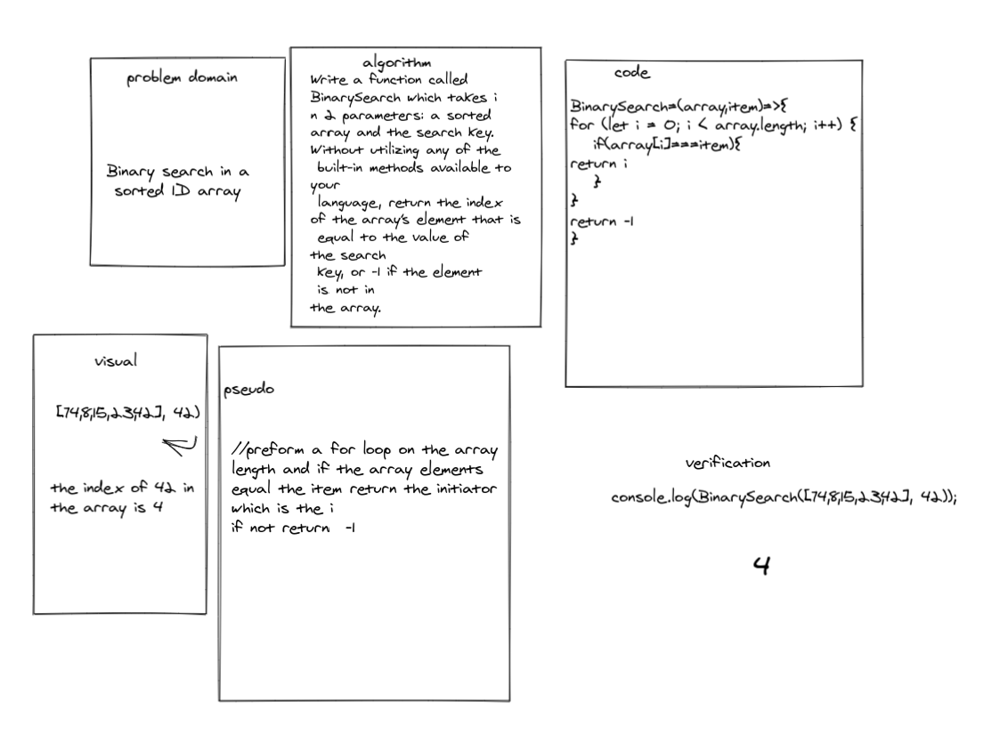

## array-shift
Write a function called BinarySearch which takes in 2 parameters: a sorted array and the search key. Without utilizing any of the built-in methods available to your language, return the index of the array’s element that is equal to the value of the search key, or -1 if the element is not in the array.

## Whiteboard Process

## Approach & Efficiency
I think my method is one better ways to implement to mutiple arrays in a dynamic way the method and for its simplcity

//preform a for loop on the array length and if the array elements equal the item return the initiator which is the (i) if not return  -1  