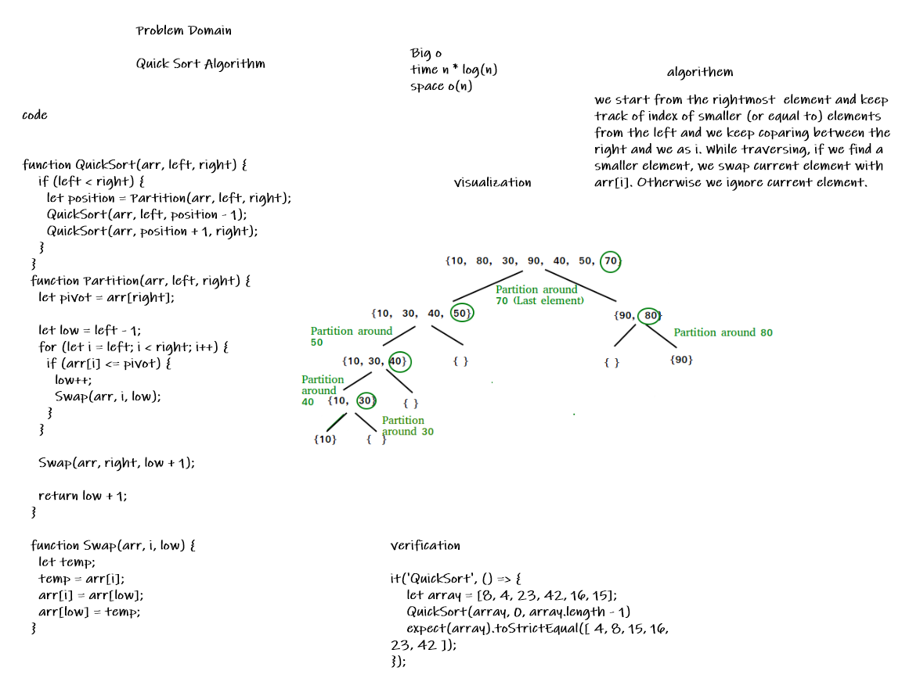

# QuickSort

Quick Sort is a sorting algorithm which uses divide and conquer technique.
In quick sort we choose an element as a pivot and we create a partition of array around that pivot.
by repeating this technique for each partition we get our array sorted
## whiteboard 

* PR
https://github.com/Marwan-Zakia/data-structures-and-algorithms/pull/37