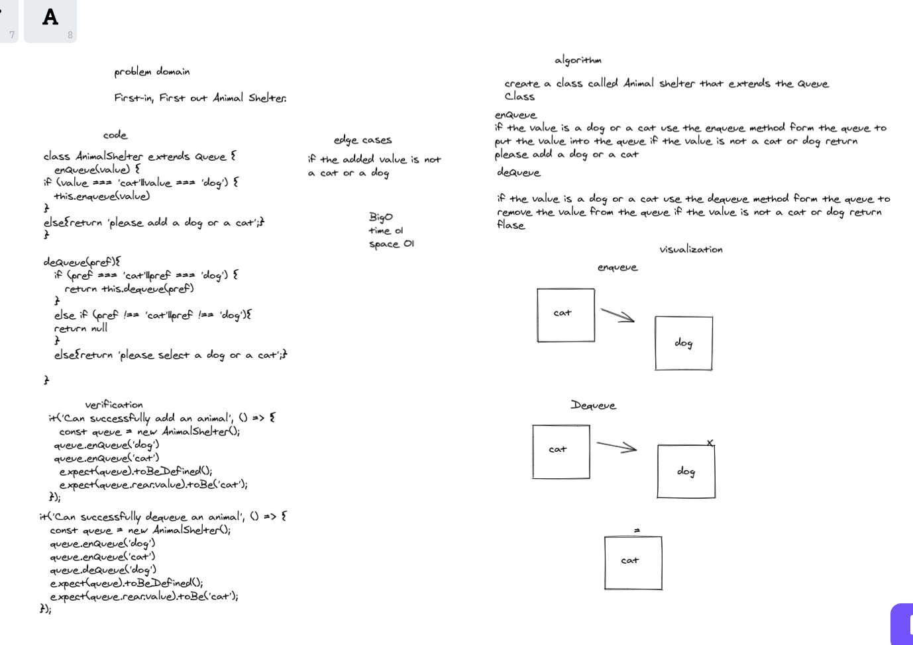
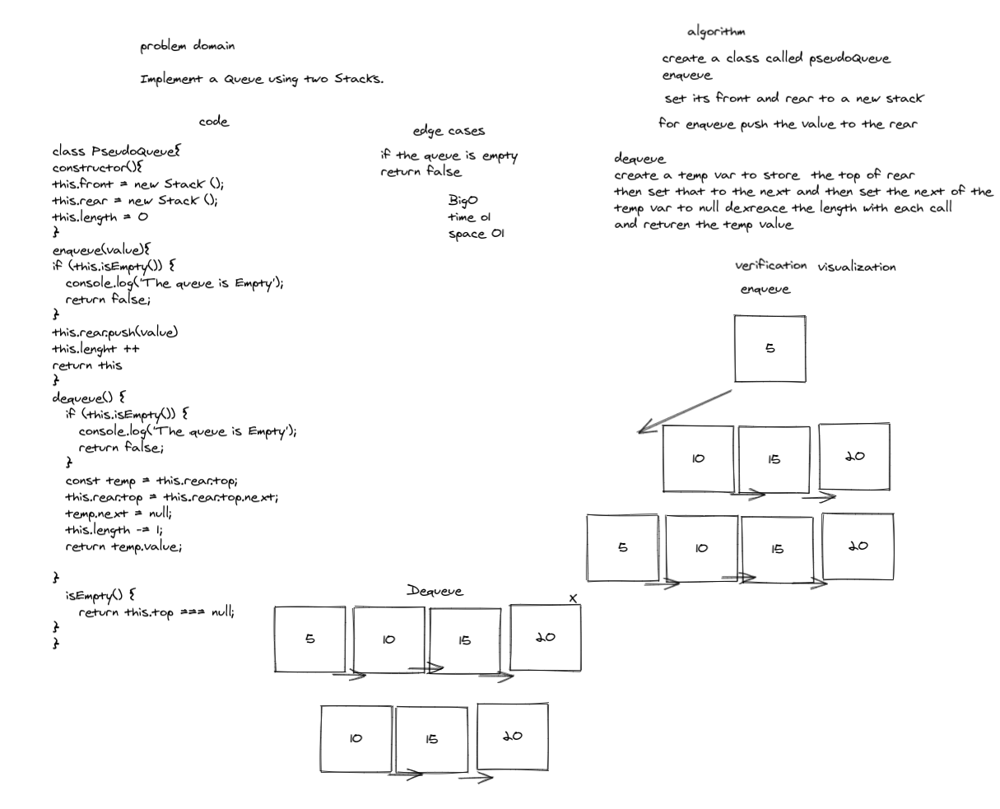

[x] Can successfully enqueue into a Pseudo queue

[x] Can successfully cheak if the queue is empty

[x] Can successfully enqueue into a Pseudo queue to be wrong

[x] Calling PseudoQueue dequeue to be truthy

[x] Calling PseudoQueue dequeue to be wrong

[x] Can successfully add an animal

[x] Can unsuccessfully add an animal

[x] Can successfully dequeue an animal

[x] Can unsuccessfully dequeue an animal

# whiteboard
## AnimalShelter

## psuedo

