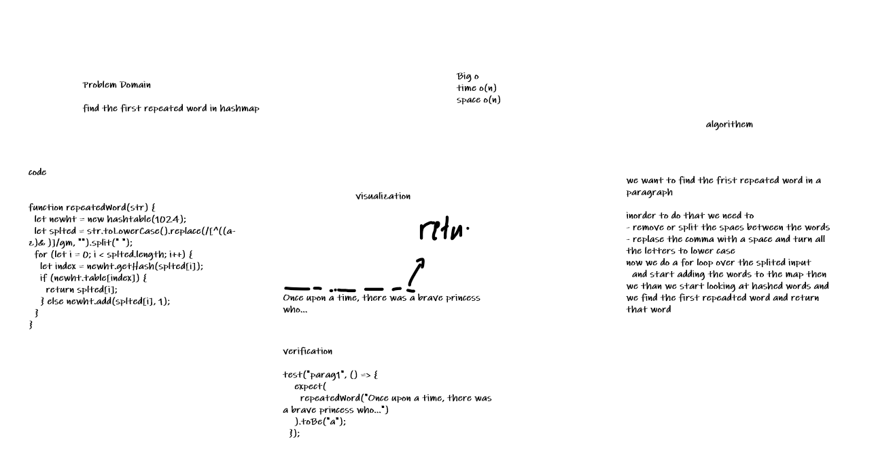

# HASH TABLE

## hashmap-repeated-word

 [X] Successfully returns true that exists in the hashtable

 [X] Adding a key/value to your hashtable results in the value being in the data structure

 [X] Retrieving based on a key returns the value stored

 [X] Successfully returns null for a key that does not exist in the hashtable

 [X] Successfully handle a collision within the hashtable

 [X] Successfully retrieve a value from a bucket within the hashtable that has a collision

 [X] Successfully hash a key to an in-range value