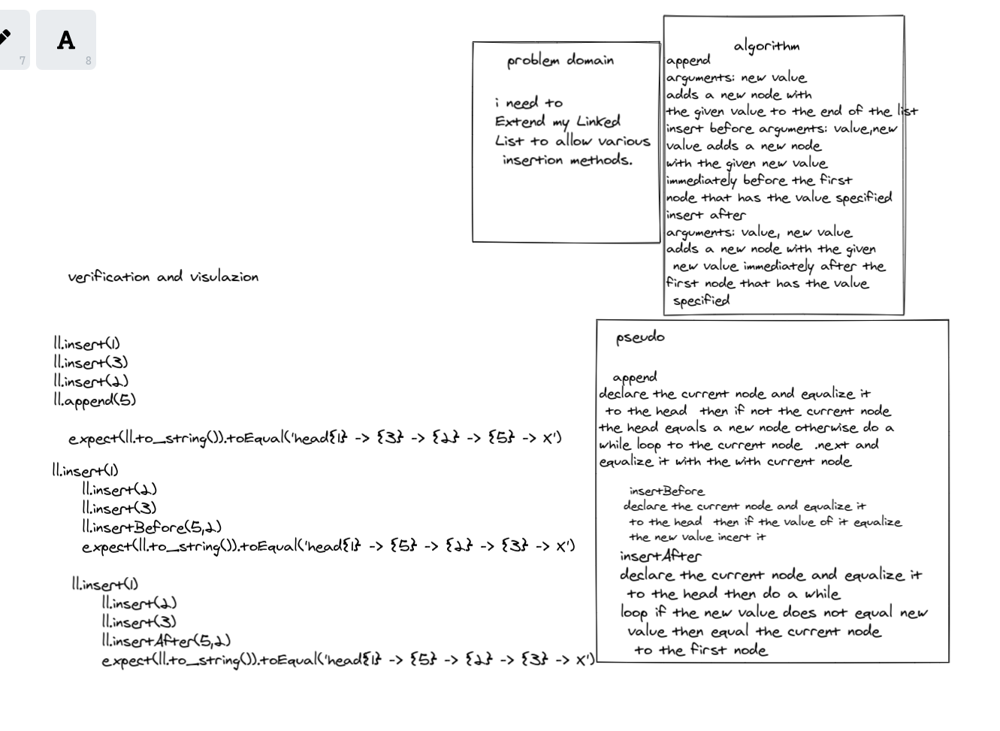
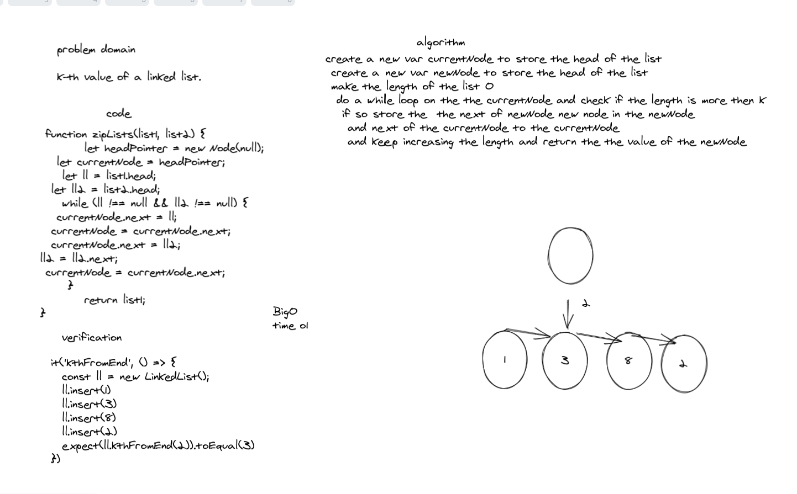
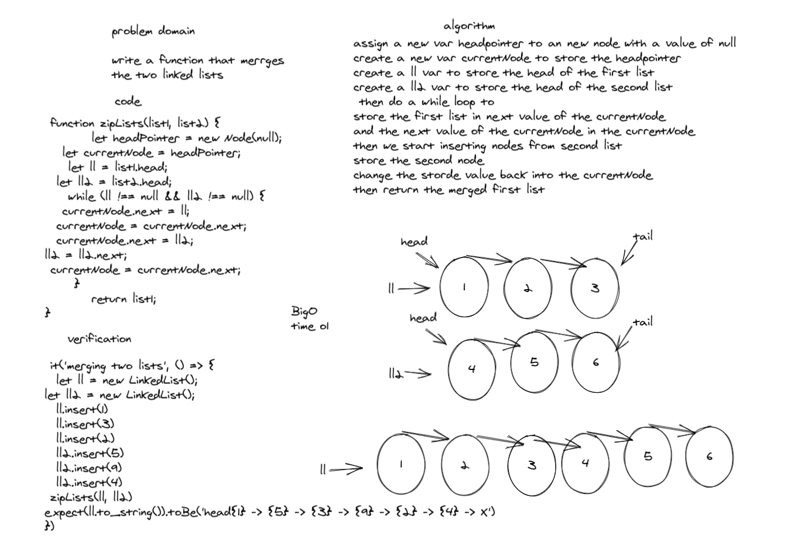

## Challenge
create a linkedlist Create a Node class that has properties for the value stored in the Node, and a pointer to the next Node and create a Linked List class
Within your Linked List class, include a head property.
Upon instantiation, an empty Linked List should be created.
also expand on it and make  3  new functions which are append and incert before and after 
## checklist
- [x] Can successfully instantiate an empty linked list
- [x] Can properly insert into the linked list
- [x] The head property will properly point to the first node in the linked list
- [x] Can properly insert multiple nodes into the linked list
- [x] Will return true when finding a value within the linked list that exists
- [x] Will return false when searching for a value in the linked list that does not exist
- [x] Can properly return a collection of all the values that exist in the linked list
- [x] can add new nodes after and before a spicfic nodes as well as append to the link list 

### white boards

