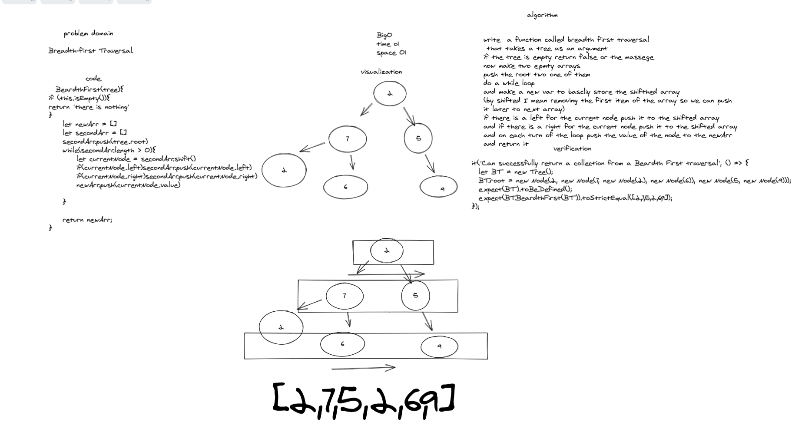
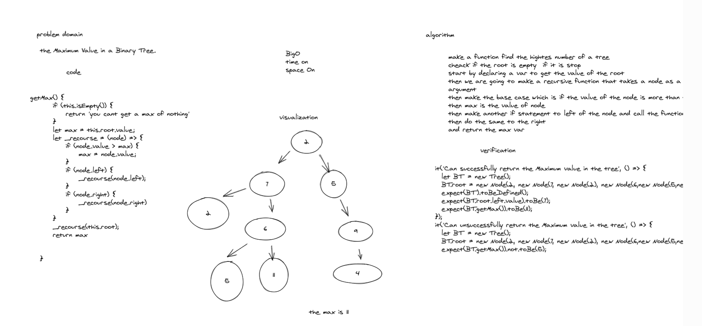

# tree-breadth-first

# Max value

# TREES and BINERY SERCH TREE 

[x] Can successfully instantiate an empty BSt

[x] Can successfully instantiate a tree with a single root node

[x] Can successfully add a left child and right child to a single root node

[x] Can successfully return a collection from a preorder traversal

[x] Can successfully return a collection from an inorder traversal

[x] Can successfully return a collection from a postorder traversal

[x] Can successfully instantiate an empty BSt

[x] Can successfully add to BST with a single root node

[x] Can successfully push onto a bst

[x] Can successfully push onto a bst

